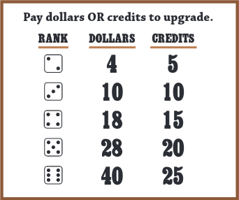

# Deadwood

## Game Description

The following description is based on the original board game's rules found [here](https://cheapass.com//wp-content/uploads/2016/07/Deadwood-Free-Edition-Rules.pdf). The main flow involves 4 players and there are alternate flows for 2-3 and 5-8 players with slightly altered gameplay.

### Overview

lilu-martin and ktaylor8 designed and coded this digital implementation of the free board game Deadwood for our object-oriented programming class in winter 2020. In Deadwood, players are bit actors looking for cowboy acting jobs in the Deadwood backlot. Players, represented on the board as 6-sided dice whose number indicates their talent rank, traverse scenes in the backlot, taking on roles less than or equal to their talent rank, where they act in the scenes for money and credits. The goal of the game is to become the most successful actor at the end of 4 "days" (or 3 "days", if there are many players), determined by your rank, credits and dollars.

### Initialization

Players start in the Trailers with rank 1. Cards represent scenes, and one is dealt face down to each set on the board. Shot markers are placed on the 1-3 numbered circles on each set to indicate the number of shots it takes to finish that scene.

### Turns

Players can do the following:

1. If you’re not working on a role: optionally move one step to any adjacent connected area and/or take a role.
   * Only 1 player/role
   * Roles on the board are extras (considered “off the card”), and roles on the cards are starring roles (considered “on the card”). Generally, but not always, high-numbered roles pay better than lower ones. You can only take roles that are >= to your talent rank.
   * Either before or after you move: At the casting office, you can pay to raise your rank. Ranks and their cost are listed on the casting office tile of the board and below:
   * 
     * You pay for the rank to move to regardless of your current rank; you don’t pay for any intermediate ranks.
2. If you’re already working on a role: act or rehearse. You can’t leave until the scene wraps.
   * Working on roles earns you credits and money. The budget of each movie is $2-6 million.
   * To act: roll another 6-sided die. Compare the result to the movie budget: >= the movie budget indicates success, while < the movie budget indicates failure.
     * On the card:
       1. Success: remove a shot counter and take 2 credits
       2. Failure: do nothing
     * Off the card:
       1. Success: remove a shot counter and take $1 and 1 credit
       2. Failure: take $1
   * To rehearse: Take 1 practice chip, which adds +1 to all die roles while acting on this role, persisting through multiple shots.
   * When a scene wraps, remove the card. If there was >= 1 player working on the card, then they get bonus money based on the following rules:
     * Bonuses for on-card roles: the active player rolls as many dice as millions of dollars of movie budget. Distribute the dice, matching each one in decreasing value to the roles in decreasing order and wrapping around when you run out of roles, so that each role has multiple dice. The players acting on these roles receive money equivalent to the dice assigned to those roles.
     * Bonuses for off-card roles: Every extra gets paid a bonus equivalent to their role’s rank (regardless of the player rank).

### End of days and end of game

When there is only one scene left, the day ends and this last scene doesn’t finish. Players return to the trailers to start the next day, if there is one, starting from the next player. Deal new scene cards onto the board for all sets and reset all shot counters. The game ends after the 4th day and players’ scores are calculated. The player with the highest score wins!
Player’s score = (1 point/dollar) + (1 point/credit) + (5 points * player rank)

### Alternate flows

2-3 players: play only 3 days

5 players: players start with 2 credits each

6 players: players start with 4 credits each

7-8 players: players start with rank 2

## How to Run Deadwood

    1. While in the repository folder compile with:  
        ./compile.sh
    2. Then decide the number of players to run the game with:
        ./run.sh src/main/resources/xml/board.xml src/main/resources/xml/cards.xml {number of total players} {number of computer players (if 0, can leave blank)}

## How to Play Our Version of Deadwood

Note 1: We implemented computer players, for which the enablement specifications are listed above. Computer players suppress ALL popups EXCEPT for errors and those at the day's end and at the game's end, but even though popups are suppressed, the board and player side panels will still update and the game will otherwise continue as normal. Computer players implement reasonable turn logic in that they move if they aren't working on a role, take roles if there are any they can take, rehearse or act when employed in a role, try to upgrade when in the casting office, etc.

Note 2: The number shown on the a die face matches its player's rank rather than numbers rolled, the latter of which is just shown in a popup.

1. Once code is running, the current player will be displayed on the top of the screen.
2. During a turn you can pick from these options:
   * "end turn" to end the turn
   * "move"
     * You will then be prompted to pick from the surrounding areas with a pop upgrade. Pick where you would like to move.
   * "take role"
     * You will then be prompted to pick a role from the set you are act. Look at the board and see the rank you must be for the roles (indicated by the dice above it). Look at the names that are printed on the role and pick one, select the same name on the pop-up that appeared
   * "upgrade"
     * If you are located in the office, you have the option to upgrade. When you press upgrade, you will be prompted to pick an upgrade based on either the currency dollars or credits. You will be notified if you don't have enough credits/dollars for that upgrade. You will then lose that corresponding amount of currency and become the corresponding level.
   * "act"
     * If you are employed you will either have a successful or failed act attempt, and given the corresponding amount of money. Scene tokens will be removed from the scene until none remain and the set will wrap up and bonuses will be distributed if necessary.
   * "rehearse"
     * If you are employed you can rehearse once per turn to increase your odds of a successful act until it's a guaranteed success.
     * Note: You are allowed to many of these things any amount of times, but you can only do one of the following (once) per turn:
       * act
       * move
       * rehearse
3. After each day, the board will reset and move the players back to the trailers.
4. After the max days it will calculate the scores and display which player is the winner.
